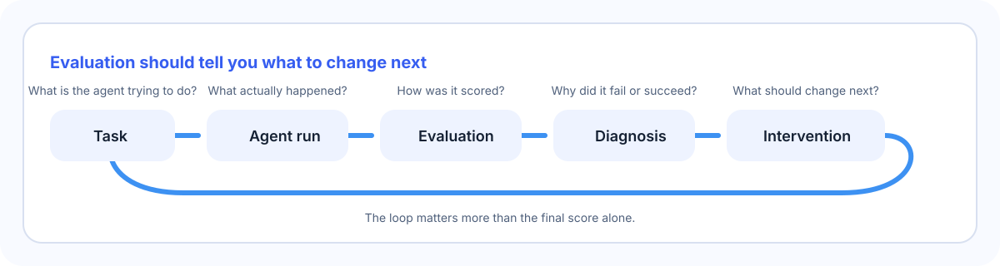
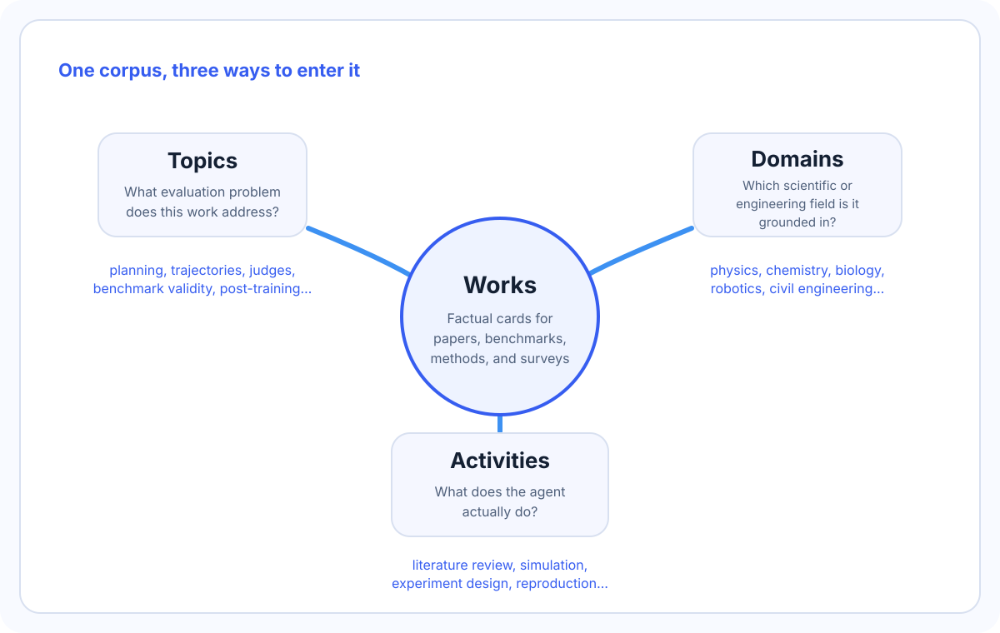

# Scientific Evaluation Environments

> **English** | [简体中文](./zh/README.md)

If you work on science, engineering, or AI, you usually hit the same problem fast: there are many papers about "agent benchmarks", but it is hard to tell what they actually measure, what kind of workflow they represent, and what you would learn from a failure.

This repository exists to make that legible.

It tracks work on evaluating scientific and engineering AI agents, but it does not stop at "what score did the model get?" The useful question is what the score helps you change next. If an agent fails to reproduce a paper, is the problem the plan, the tool use, the verifier, the task design, or the budget? Those are different failures, and they call for different repairs.

In other words, the repository follows this loop:



The repository itself is simple:

- One work card tells you what one paper or project actually contributed.
- Three independent indexes help you find that same card from different questions.
- Monthly reports explain what changed in the literature, not just which PDFs appeared.



This is a reference library, not a benchmark implementation. The repository's [Explanation Style Guide](./EXPLANATION_STYLE.md) keeps the writing concrete: name the actor, show what changed, trace one real object when that helps, and say what the result still does not establish.

---

## Start here

> **Live interactive explorer:** [Open SciEval](https://yuema137.github.io/scieval/) for a searchable, visual view of this repository. The Markdown here is canonical; the website is an automatically generated snapshot.

If you already know what kind of question you have, use the matching entry point:

| If your question is... | Start here |
|---|---|
| "What evaluation problem is this paper really about?" | [Topics](./topics/README.md) |
| "Which work exists for physics / chemistry / biology / robotics / civil engineering?" | [Domains](./domains/README.md) |
| "Which benchmarks make agents do literature review, simulation, experiment design, or reproduction?" | [Activities](./activities/README.md) |
| "What exactly does this one benchmark or method do?" | [Works](./works/README.md) |
| "What was added recently, and why does it matter?" | [Monthly reports](./monthly/README.md) |
| "What is the chronology by earliest public release?" | [Works by first appearance](./WORKS_BY_DATE.md) |
| "I want the interactive view." | [SciEval explorer](https://yuema137.github.io/scieval/) |

These entry points are not competing taxonomies. They are three ways of reading the same corpus:

```text
Topic     → what evaluation problem does this work address?
Domain    → which scientific or engineering field is it grounded in?
Activity  → what does the evaluated agent actually do?
```

A single work can appear under several topics, several domains, and several activities at once.

---

## What is in scope

The short version is:

- in scope when evaluation is the point
- out of scope when evaluation is only the last results table

More concretely, this repository includes:

- scientific and engineering agent benchmarks
- evaluation methods for trajectories, judges, credit assignment, and resource use
- work on benchmark validity, contamination, and verifier design
- evaluation-driven improvement loops for skills, harnesses, data curation, and post-training
- surveys and position papers that clarify the space

It does not include ordinary training or agent papers just because they report benchmark numbers. The cutline is operational: does evaluation define the objective, the feedback signal, the diagnosis, the intervention choice, or the experimental environment?

## How to read the repository

The easiest way to avoid getting lost is to remember the division of labor:

- [Works](./works/README.md) are factual cards for individual papers, benchmarks, methods, and surveys.
- [Topics](./topics/README.md) are literature reviews about evaluation questions.
- [Domains](./domains/README.md) tell you what scientific or engineering field a work is grounded in.
- [Activities](./activities/README.md) tell you what the agent actually does.
- [Monthly reports](./monthly/README.md) explain what changed month by month.

The Markdown files are the ground truth. The HTML explorer is only a render layer generated from those files.

## Current coverage

The repository currently contains:

- **384** work cards
- **15** topic pages
- **19** domain pages
- **11** activity pages
- **32** monthly reports from 2024-01 through 2026-08

Coverage is broad across both sciences and engineering. The heaviest current concentrations are in:

- scientific agent benchmarks
- trajectory evaluation
- physics, chemistry, biology, astronomy, and civil/structural engineering
- scientific problem solving, scientific software/workflow engineering, and data analysis

## Browse by Topic

A topic starts with an evaluation problem. Some topics ask what behavior to measure, such as planning or long-horizon work. Others ask whether the measurement itself is trustworthy, or how its feedback changes skills, harnesses, data, and post-training. Each topic page explains that problem, groups the main approaches, and compares them using dimensions that fit the problem. See [`topics/`](./topics/README.md) for the full index.

| Topic | What you'll find |
|---|---|
| [General Long-Horizon Agent Benchmarks](./topics/long_horizon_evaluation.md) | Benchmarks whose tasks need many sequential decisions, tool calls, or turns — where failures accumulate and intermediate state matters. |
| [Scientific Agent Benchmarks](./topics/scientific_agents.md) | Agents on tasks drawn from real scientific research and practice, judged against published or expert-defined outcomes. |
| [Planning & Decision-Making Evaluation](./topics/planning_decision_evaluation.md) | Whether an agent selects a sound plan or next action from the current state, goals, constraints, tools, and evidence, and replans appropriately after feedback. |
| [Hierarchical Decision Abstraction](./topics/hierarchical_decision_abstraction.md) | How agent behavior should be represented, evaluated, and optimized across goals, strategies, subgoals, semantic actions, primitive actions, and control signals. |
| [Trajectory Evaluation](./topics/trajectory_evaluation.md) | Methods that score the whole sequence of actions and intermediate states, not just the final answer. |
| [Skill Hierarchy](./topics/skill_hierarchy.md) | Decomposing a complex capability into narrower subskills, each scored separately. |
| [Credit Assignment](./topics/credit_assignment.md) | Attributing a trajectory's success or failure to specific steps or subgoals — dense rewards, partial credit, per-step scoring. |
| [Resource-aware Evaluation](./topics/resource_aware_evaluation.md) | Treating tokens, fees, wall-clock time, or compute as part of what the benchmark measures — sometimes as an explicit objective. |
| [Evaluator Reliability & Validation](./topics/evaluator_reliability_validation.md) | Validating judges, reward models, rubrics, and verifiers against human or deterministic ground truth and downstream use. |
| [Benchmark Design, Validity & Contamination](./topics/benchmark_design_validity_contamination.md) | Task construction, verifier rigor, contamination resistance, dynamic evaluation, and ecological validity. |
| [Skill Learning & Evolution](./topics/skill_learning_evolution.md) | Turning experience and evaluation feedback into reusable skills, then testing transfer and failure modes. |
| [Agent Harnesses & Scaffolding](./topics/agent_harnesses_scaffolding.md) | Measuring, attributing, and optimizing the control structures surrounding a model. |
| [Evaluation-Driven Data Curation](./topics/evaluation_driven_data_curation.md) | Revising selection, generation, filtering, or mixture policies from downstream evaluation feedback. |
| [Evaluation-Driven Post-Training](./topics/evaluation_driven_post_training.md) | Using evaluation as an objective, feedback signal, or experimental environment for model and agent improvement. |
| [Survey](./topics/survey.md) | Surveys and position papers on agent evaluation — an index of references rather than a task suite. |

---

## Browse by Domain

Domain pages answer a narrower question: where does the evaluated work happen? A physics benchmark and a biology benchmark may use the same evaluation method but face different tools, artifacts, costs, and correctness standards. The counts below show current coverage; the maintained index and per-domain tables live in [`domains/`](./domains/README.md).

**Sciences**

| Domain | Works |
|---|--:|
| [Physics](./domains/physics.md) | 48 |
| [Chemistry](./domains/chemistry.md) | 39 |
| [Biology](./domains/biology.md) | 38 |
| [Materials Science](./domains/materials_science.md) | 28 |
| [AI & Machine Learning Research](./domains/ai_ml_research.md) | 28 |
| [Mathematics](./domains/mathematics.md) | 19 |
| [Medicine & Health](./domains/medicine_health.md) | 22 |
| [Neuroscience & Cognitive Science](./domains/neuroscience_cognitive_science.md) | 13 |
| [Astronomy](./domains/astronomy.md) | 34 |
| [Earth Science](./domains/earth_science.md) | 12 |
| [Computer Science](./domains/computer_science.md) | 7 |
| [Environmental Science](./domains/environmental_science.md) | 6 |

**Engineering**

| Domain | Works |
|---|--:|
| [Electrical Engineering](./domains/electrical_engineering.md) | 18 |
| [Robotics](./domains/robotics.md) | 18 |
| [Software & Systems Engineering](./domains/software_systems_engineering.md) | 18 |
| [Mechanical & Aerospace Engineering](./domains/mechanical_aerospace_engineering.md) | 12 |
| [Energy Systems](./domains/energy_systems.md) | 5 |
| [Civil & Structural Engineering](./domains/civil_structural_engineering.md) | 30 |
| [Chemical Engineering](./domains/chemical_engineering.md) | 12 |

Narrower fields fold into these canonical domains (bioinformatics → Biology, GIS → Earth Science, psychology → Neuroscience & Cognitive Science, …), and a work may appear in several domains. Web/UI agents, computer use, and pure evaluation methodology are not science or engineering domains and do not appear here.

---

## Browse by Research Activity

Activity pages follow the work itself. Does the agent search literature, run a simulation, design an experiment, reproduce a result, or carry a project end to end? The same activity can appear in several domains and use several evaluation methods. Work that evaluates no scientific or research task, such as a survey or pure evaluation methodology, carries an explicit `N/A`. See [`activities/`](./activities/README.md) for the full index.

| Activity | What it covers | Works |
|---|---|--:|
| [Scientific Problem Solving & Reasoning](./activities/scientific_problem_solving_reasoning.md) | Scientific QA, derivations, proofs, quantitative and multimodal problem solving, diagnostic reasoning | 94 |
| [Scientific Software & Workflow Engineering](./activities/scientific_software_workflow_engineering.md) | Scientific/engineering code, repository and pipeline engineering, HDL and formal-spec code | 72 |
| [Data Analysis & Statistical Inference](./activities/data_analysis_statistical_inference.md) | Statistical analysis and inference, bioinformatics/omics analysis, data interpretation | 44 |
| [Experiment Design & Scientific Discovery](./activities/experiment_design_discovery.md) | Experiment and observation planning, hypothesis generation, law discovery | 23 |
| [Simulation & Scientific Computing](./activities/simulation_scientific_computing.md) | Numerical simulation, PDE/FEM, MD/DFT, running and building scientific simulators | 35 |
| [Modeling & Prediction](./activities/modeling_prediction.md) | Predictive and surrogate modelling, property prediction, forecasting | 22 |
| [Optimization & Engineering Design](./activities/optimization_engineering_design.md) | Parameter and controller tuning, engineering/inverse design, materials and molecular design | 27 |
| [Literature Search & Evidence Synthesis](./activities/literature_evidence_synthesis.md) | Literature retrieval, systematic review, evidence synthesis, literature-grounded extraction | 23 |
| [Research Reproduction & Replication](./activities/research_reproduction_replication.md) | Reproducing published analyses, results, and methods; matching reported findings | 11 |
| [End-to-End Research](./activities/end_to_end_research.md) | Multi-stage research lifecycle across several major phases | 9 |
| [Laboratory & Instrument Control](./activities/laboratory_instrument_control.md) | Instrument, microscope, and beamline control; lab automation; behaviour-defined control code | 3 |

---

## Scope

Work is in scope when evaluation changes what we know or what the development loop does next. That includes benchmarks, diagnostic methods, evaluator validation, benchmark-validity research, scientific workflows, and systems that use evaluation to revise skills, harnesses, data, or post-training.

A paper is not in scope merely because it reports benchmark scores. Pure training, optimization, data, memory, or multi-agent work stays out when evaluation appears only in the final results table. The test is operational: does evaluation define the objective, supply feedback, select an intervention, diagnose a failure, or serve as the experiment environment?

"Works" is broader than "benchmarks": the collection holds cards for benchmarks, evaluation methodologies, evaluation frameworks, evaluation-focused RL contributions, surveys, and position papers. Each card notes its type explicitly. The collection currently holds **383 work cards**, **15 topic pages**, **19 domain pages**, and **11 activity pages**, each mirrored in Chinese under [`zh/`](./zh/README.md).

---

## A Living Knowledge Base

This repository is maintained continuously.

Every three days, an update agent searches public sources for new work, drafts cards and index changes, and opens a pull request for human review. On the first day of each month, the repository also prepares a bilingual monthly report for the previous month. Both the daily update path and the monthly report path support manual triggering as well, so maintainers can refresh a specific window without inventing duplicate files.

## Interactive explorer

The repository is good for maintenance and provenance. It is less good for visual browsing. The companion explorer fixes that without changing the source of truth.

The explorer:

- is deployed as an isolated `/scieval/` subpage on the maintainer's GitHub Pages site
- reads generated JSON exported from repository Markdown
- shows the corpus as a searchable, filterable interface
- adds visual structure such as the first-appearance timeline and axis overview

After relevant Markdown changes merge here, an automated workflow builds and
validates a self-contained snapshot. A guarded pull request then updates only
`scieval/**` in the personal-site repository. If that process fails, the
previous snapshot and the rest of the personal site stay unchanged.

The explorer does **not** own content. If the site and a Markdown file disagree, the Markdown file wins.

### How the site stays in sync

After a relevant change reaches `main`, [`Publish Explorer Snapshot`](./.github/workflows/explorer-pages.yml) rebuilds and validates the site from the repository's Markdown. It then opens a guarded machine pull request in the personal-site repository that changes only `scieval/**`. The personal site validates that snapshot before merging and deploying it. A failed build or validation leaves the previous live snapshot and the rest of the personal site untouched.

---

## Repository Structure

The knowledge base has **four layers**: the works layer, plus three co-equal aggregation axes over it.

| Directory | Role |
|---|---|
| [`works/`](./works/README.md) | One factual reference card per work. Flat, kebab-case, one Markdown file each. |
| [`topics/`](./topics/README.md) | Literature-review pages — the evaluation-research axis spanning measurement, diagnosis, and improvement. Each topic owns its own comparison table. |
| [`domains/`](./domains/README.md) | Field-axis reference pages, one per canonical science or engineering domain, with a fixed-column comparison table. |
| [`activities/`](./activities/README.md) | Task-axis reference pages, one per canonical research activity, with Definition, Scope, task patterns, and a comparison table. |
| [`zh/`](./zh/README.md) | Chinese mirror of every page, synced after each English batch. |

Two navigational conventions keep the axes in sync: each card's `Topics` block links up to its topics, and each topic page's `Related Works` links back down to its cards. The domain mapping is maintained one-way on the domain pages. Root-level [`AGENT.md`](./AGENT.md) is the repository constitution and [`CLAUDE.md`](./CLAUDE.md) is its quick reference; each directory's own `README.md` documents its page template and rules.

---

## Contributing

Contributions are welcome. Automated updates complement, rather than replace, community contributions; missing or newly relevant work can still be proposed manually. All contributor and maintainer rules — reference validation, page templates, the canonical taxonomies, and the bilingual sync cadence — live in [`AGENT.md`](./AGENT.md) (the constitution) and [`CLAUDE.md`](./CLAUDE.md) (its quick reference), with layer-specific rules in each directory's README. Every page is available in English and Chinese; use the language switcher at the top of any page.
